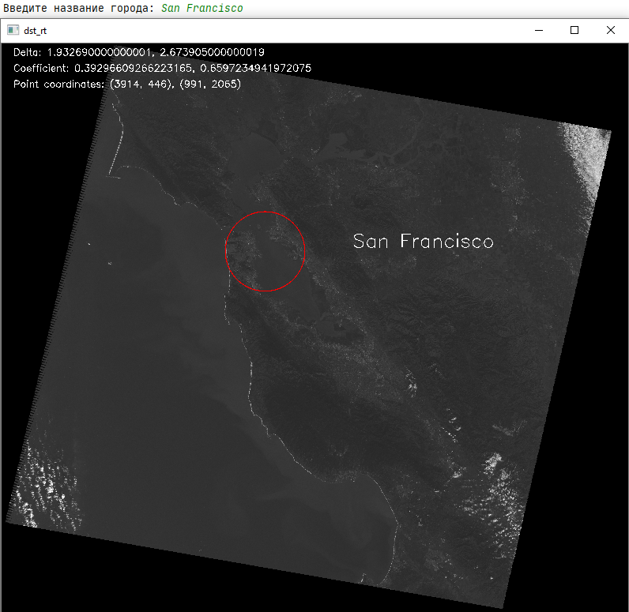
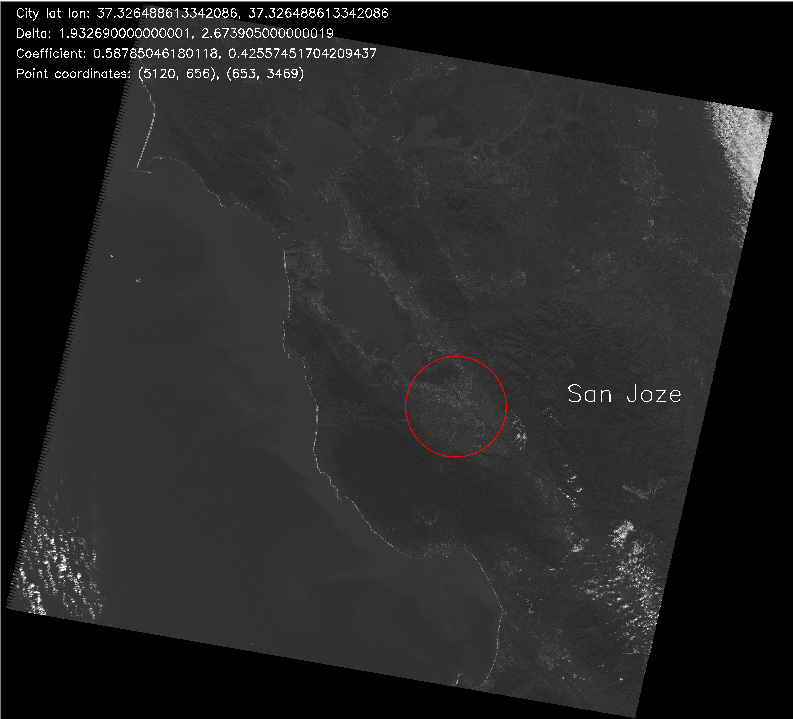
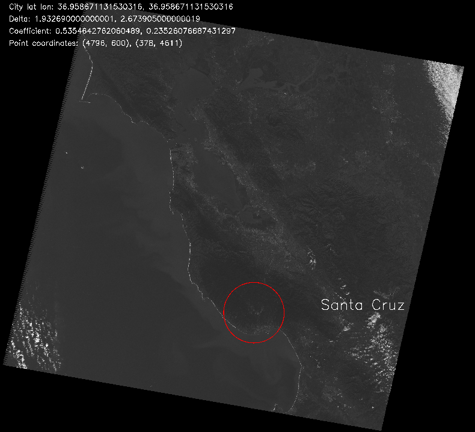

Программа предназначена для обозначения на снимке со спутника города с заданными координатам.

Для работы программы требуется разархивировать снимок, т.к github не ползволяет загружать файлы размером больше 25 мб.

Алгоритм работы
-----------

  - Функция get_mean парсит MTL файл и записывает в переменные значения долготы и широты для каждого угла снимка
  - Рассчитываются значения дельты по долготе и широте на спутнике, также значения долготы и широты по краям снимка усредняются, т.к. снимок выполняется практически точно по линиям мередиан и параллелей 
  - Функция get_point получает значения точек в пикселях, которые помогут получить местоположение искомого города. С точки зрения геометрии - проводятся по прямой через каждую из двух точек, перпендикулярно краям снимков, а точка пересечения этих прямх и будет искомой точкой центра города.

Геометрия
-----

  - 

Примеры работы программы 
-----

  - San Francisco 

  - San Joze 

  - Santa Cruz
    

  - Concord
    

